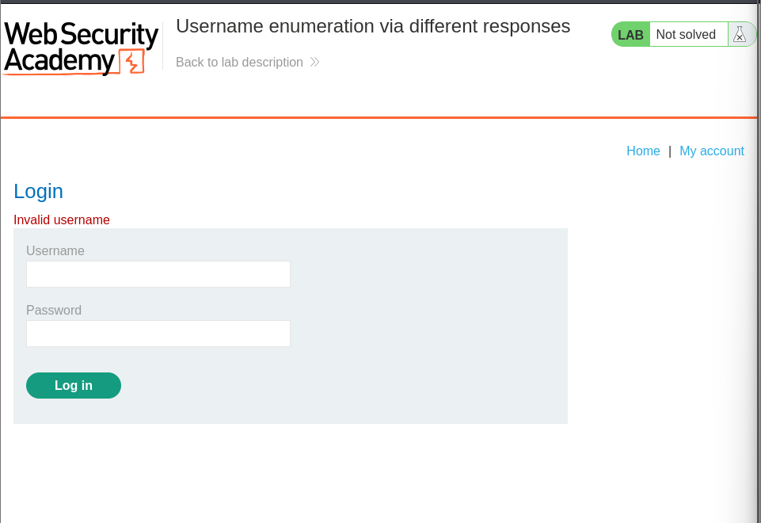
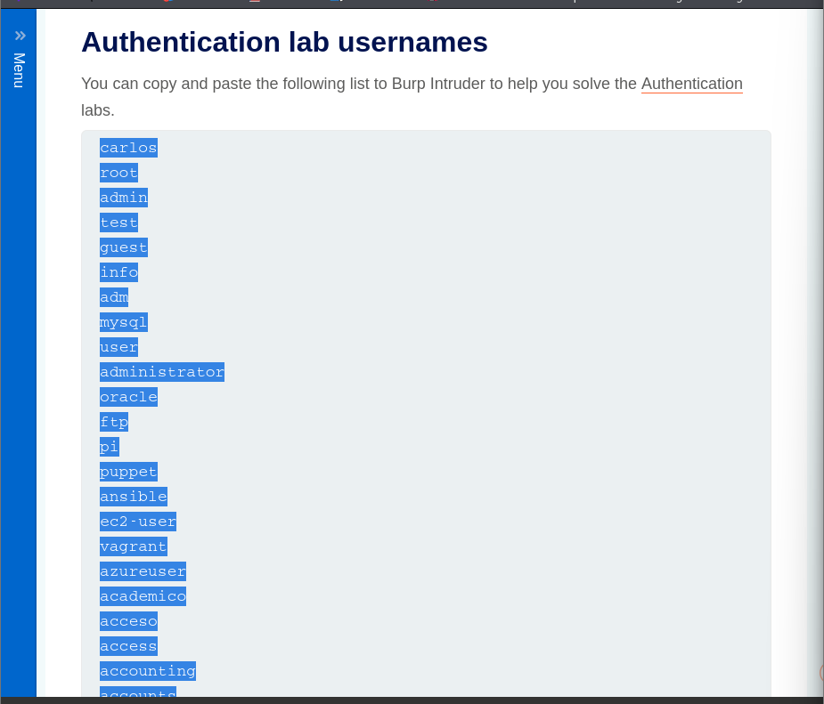
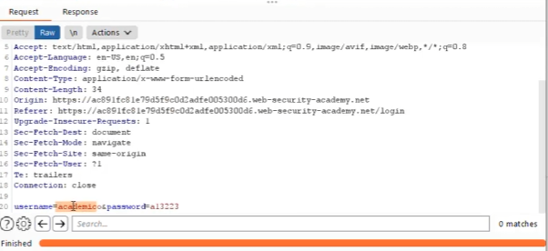
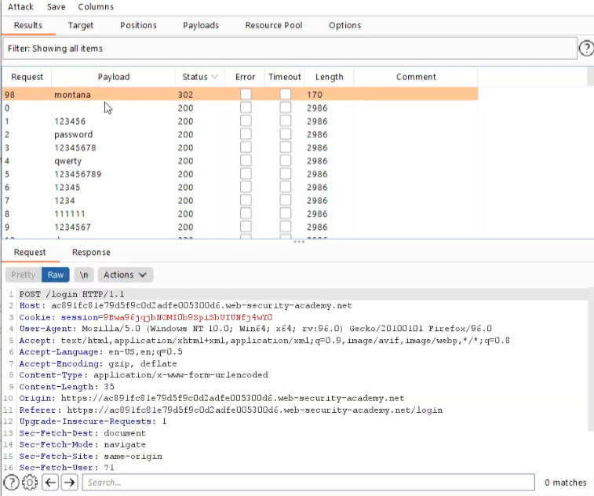
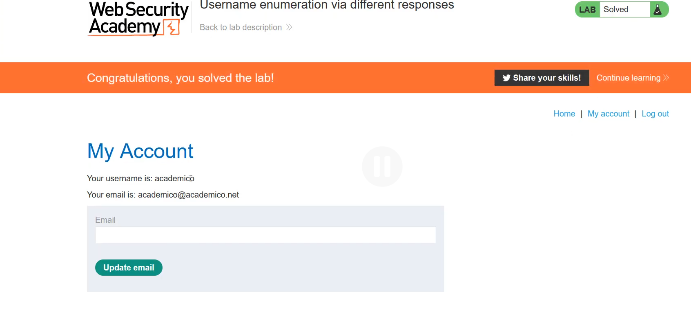

# Authentication Vulnerabilities

Authentication vulnerabilities allow attackers to gain access to sensitive data and functionality. For this reason, it is important to learn how to identify and exploit authentication vulnerabilities and understand how to bypass them.

## What is Authentication?

Authentication is the process of verifying the identity of a user or client. The three main types of authentication are as follows:

1. **Something you know**: A password or the answer to a security question.
2. **Something you have**: A physical card or a token.
3. **Something you are**: Biometrics or patterns of behavior.

## Difference Between Authentication and Authorization

- **Authentication**: Determines whether a user is who they claim to be.
- **Authorization**: Ensures that the user, once verified, is allowed to perform specific activities.

## Vulnerabilities in Password-Based Login

### Brute-Force Attacks

A brute-force attack occurs when an attacker uses a system of trial and error to guess valid user credentials. These attacks are typically automated using wordlists of usernames and passwords. Attackers can also use publicly available knowledge to fine-tune brute-force attacks and increase the chance of successfully bypassing password checks.

#### Brute-Forcing Usernames

Usernames are easier to guess if a regular pattern is confirmed, like an email address. While auditing, check whether the website discloses potential usernames publicly.

#### Brute-Forcing Passwords

Passwords can be brute-forced, with the difficulty varying based on the strength of the password. Many websites adopt password policies that force users to create high-entropy (random) passwords that are harder to crack using simple brute-force methods. However, users might create predictable variations, such as:

- If "mypassword" is not allowed, users might try:
  - `Mypassword!`
  - `mypas$$word`

### Username Enumeration

When an attacker observes changes in a website's behavior to identify whether a given username is valid, it is called username enumeration. This reduces the time and effort required to brute-force a login because the attacker can quickly generate a shortlist of valid usernames.

#### Indicators of Username Enumeration

While attempting brute-force attacks on a login page, pay attention to any differences in:

1. **Status codes**
2. **Error messages**
3. **Response times**

## Lab: Username Enumeration via Different Responses

### Steps:

1. **Capture the Login Request**
   - Go to Burp Suite and look for the login request.
   - Right-click and send it to Intruder.

   

2. **Load the Username List**
   - Use the list of usernames provided by Burp Suite.
   - Paste the list into the payloads section of Intruder.

   

3. **Analyze the Responses**
   - Sort the responses by length.
   - Check the response messages. For example:
     - "Incorrect password" indicates a valid username.
     - "Incorrect username" indicates an invalid username.

   

4. **Identify the Correct Username**
   - Copy the correct username and use it for further testing.

   

5. **Brute-Force Passwords**
   - Sort responses by status codes (e.g., `302` for successful login).
   - Send the response to the browser to verify.

   

   

