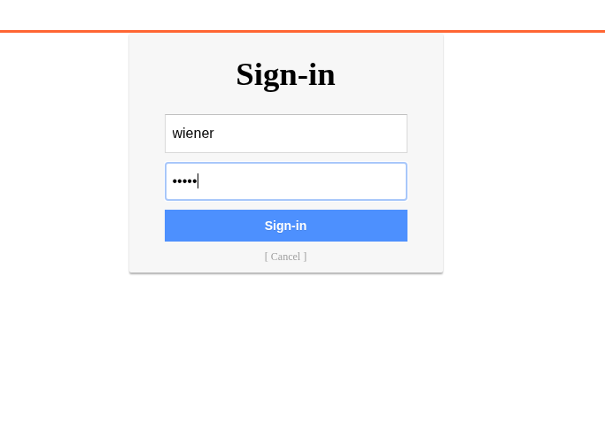
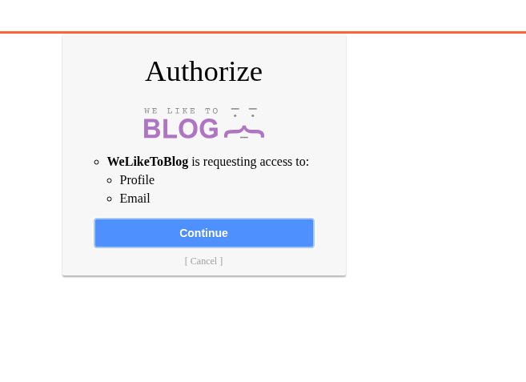
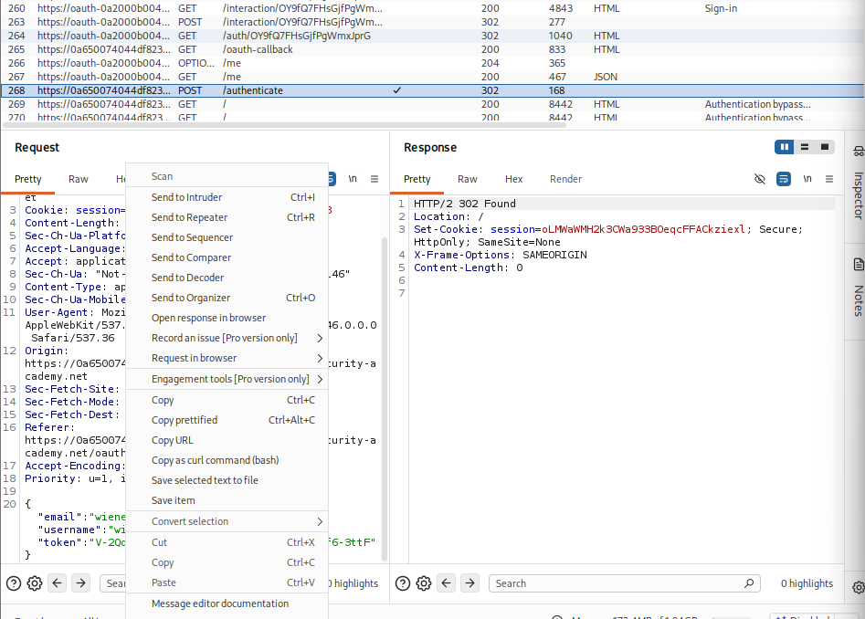
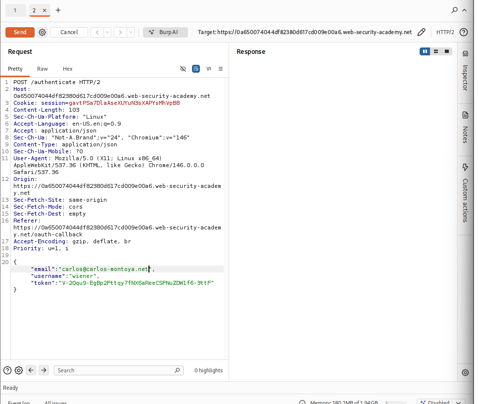
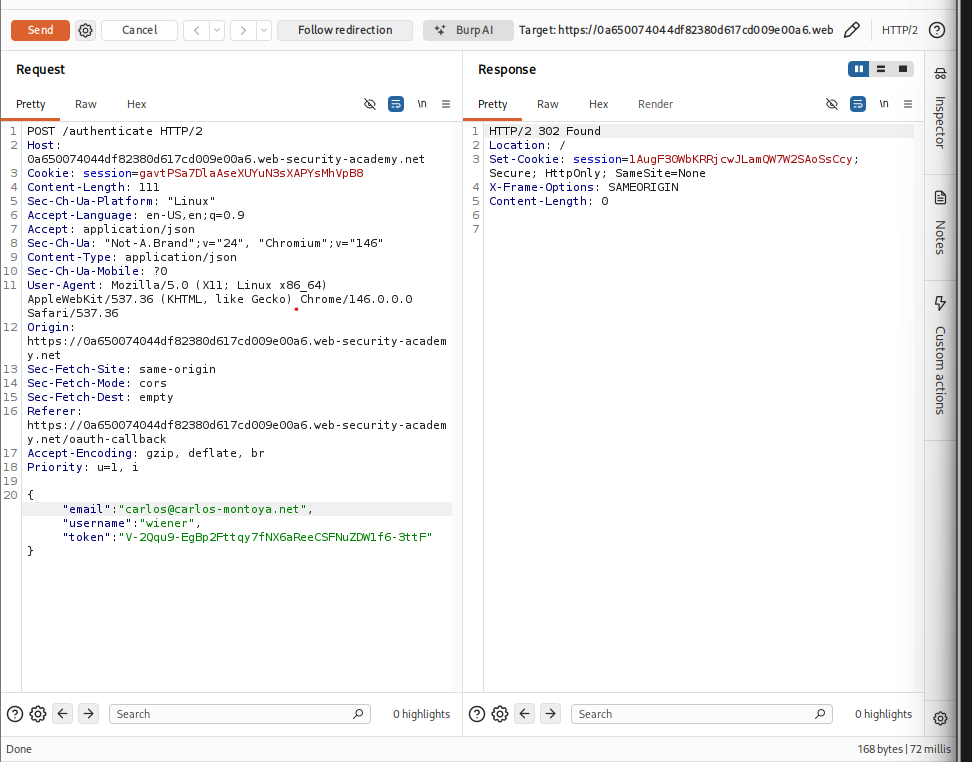

# OAuth 2.0 Authentication vulnerabilities:

OAuth is the feature that allows a user to log in using social media account. The chances are that the feature is built using the OAuth 2.0 framework. OAuth 2.0 us highly interesting for attackers because it is both extremely common and inherently prone to implementation mistakes. 

# How does OAuth 2.0 work?
OAuth 2.0 was originally developed as a way of sharing access to specific data betweem applications. It works by defining a series of interactions between three distinct parties such as a client application, a resource owner, and the OAuth service provider.

OAuth flows or "grant types". 
"Authorization code" and "implicit" grant.

## Lab: Authentication bypass via OAuth implicit flow

1. We log in using wiener and peter. 

Then we are redirected to the authorize page:

2. We now take a look at the POST request and send the request ot repeater.
   

3. We change the email to carlos@carlos-montoya.net and send the request.

4. If we send the request, we can see that we will get a 302 response.

5. We simply copy the URL and paste it in the browser and solve the lab!
   

# Causes of OAuth vulnerabilities

OAuth vulnerabilities arise because the OAuth specification is relatively vague and flexibly by design. 
OAuth lacks in-built security features.

# Identifying OAuth authentication
The most reliable way to identify is a browser is using OAuth is to proxy traffic through Burp and chekc the corresponding HTTP messages. Regardless of which OAuth grant type is being used, the first request will always be a request to the /authorization endpoint containing a number of query parameters that are used for OAuth. 
In addition to that, we need to keep an eye out for the client_id, redirect_uri and response_type parameteres.

# Recon
Doing some basic recon of the OAuth service being used can point in the right direction when it comes to identifying vulnerabilities. 
Without saiying that study of HTTP interactions that make up the OAuth flow. If an external OAuth service is used, we should be able to identify the specific provider from the hostname to which the authorization request is sent. As these services provide a public API, there is often detailed documentation available that should reveal all kinds of information such as the exact names of the endpoints and which configuration options are being used.

---

# Vulnerabilities in the OAuth client application

Client applications will often use a reputable, battle-hardened OAuth service that is well protected against widely known exploits. However, their own side of the implementation might be less secure.

The OAuth specification is relatively loosely defined. This is especially true with regard to the implementation by the client app. 

## Improper implementation of the implicit grant type

Due to the dangers introduced by sending access tokens via the browser, the implicit grant type is mainly recommended for single-page applications. 

Implicit grant type: the client app receives the access token immediately after the user give their consent.

Mainly recommended for a single page applications. 

Access token is send from the OAuth service to the client app via the user's browser as a URL fragment. 
Client accesses the token using JS. 

### Lab: Authentication bypass via OAuth implicit flow

1. First we proxy the traffic through Burp while completing the OAuth process. After completion, we will be redirected to the home page.

2. We can see that, the client application receives some basic information about the user from the OAuth service. It then logs the user in by sending a POST request containing this info to /authenticate endpoint along with access token.

3. We then send the POST /authenticate request to Burp Repeater. In Repeater, change the email address to carlos@carlos-montoya.net and send the request. 
   

We can see that there is no error.

4. We now right-click on the POST request and select "Request in browser" > "In original session". Copy this URL and paste it in the browser to finish the lab.

## Flawed CSRF Protection:

Although many components of the OAuth flows are optional, some of them are strongly recommended unless there's an important reason not to use them. One such example is the "state" parameter.

The "state" parameter should contain an unguessable value such as the has of something tied to the user's session when it first initiates the OAuth flow. This value is then passed back and forth between the client applicaton and the OAuth service as a form of CSRF token for the client application. Therefore, becomes extremely interesting from an attacker's perspective. It potentially means that they can initiate an OAuth flow themselves before tricking a user's browser into completing it, similar to a traditional CSRF attack. This can have severe consequences depending on how OAuth is being used by the client app.

Consider a website that allows users to log in using either a classic, password-based mechanism or by linking their account to a social media profile using OAuth. In this case, if the app fails to use the state parameter, an attacker could potentially hijack a victim user's account on the client app by binding it to their own social media account.

### LAB: Forced OAuth profile linking

1. First we log in using a normal form. We are then taken to a normal login page, but notice that there is an option to log in using social media profile instead. 

2. We attach a social profile. We are then redirected to the social media website, where we log in using social media creds to complete the OAuth flow. Afterwards, we will be redirected back to the blog website.

3. When we log out and log in again using social media, we instantly get logged in wihtout being asked about anything else. 
   
4. We now need to study the Proxy History.We can see that the GET /auth?client_id[...] request, sends the authorization code to /oauth-linking. There is not "state" parameter to protect against CSRF attacks.

5. We now turn on the proxy interception and select the "Attach a social profile" option again. We are looking for the GET /oatuh-linking?code=[...]. We then right-click on this request and select "Copy URL" and drop the request.

6. We create an <iFrame> exploit and deliver the exploit to the victim.
   
   

7. After this step we log out and log in using social media again and can see that we are logged in as admin. 

we now go ahead and delete this. 

8. After deleting the user, we have no sucessfully completed the lab.
 

## Leaking authorization codes and access tokens

One of the most infamous OAuth-based vulnerabilty is when the configuration of the OAuth service itself enables attackers to steal authorization codes or access tokens associated with other users' accounts. By stealing a valid code or token, the attacker may be able to access the victim's data. Ultimately, this can completely compromise their account- the attacker. By stealing a valid code or token, the attacker may be able to access the victim's data. 

Depending on the grant type, either a code or token is sent via the victims browser to /callback endpoint specified in the redirect_uri parameter of the authorization request. 

### LAB: OAuth account hijacking via redirect_uri

1. We log in to the account provided. Here we are simply logged in automatically. 

2. As we still had an active session with the OAuth service, we didn't need to enter our log in credentials. 

3. We change the redirect_uri to point the exploit server and send the request and follow the redirect. 

