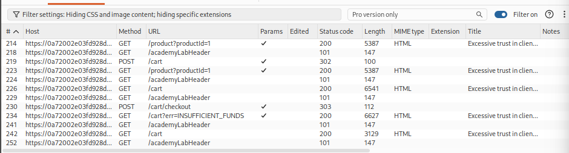
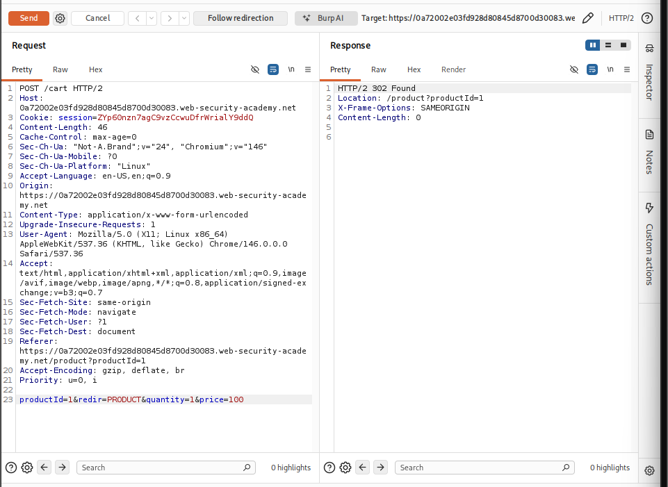
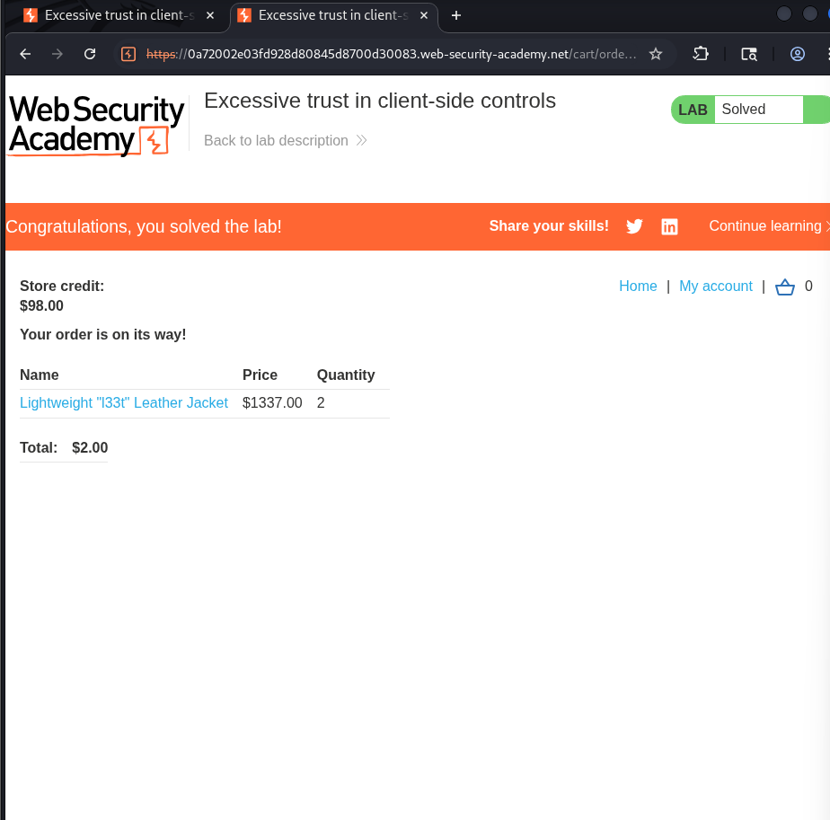

# Business Logic Vulnerabilties

The vulnerabitlies in the design and implementation of an application that can allow an attacker to elicit unintended behavior. This enables the attackers to manipulate legitimate functionality to achieve malicious goals. 

In simple words, the attackers might be able to do some things that they shouldn't be allowed in the first place. For an example, they might be able to complete a transaction without going through the purchase workflow.

Logic-based vulns can be diverse and are often unique to the application and its specific functionality. This makes it difficult to detect using automated vulnerability scanners. 

Business logic vulnerabilties often arise because of the design and developmenet teams mistakes.
In order to avoid logic flaws, developers need to understand the applicaction as a whole. Developers working on large code bases might not have a proper understanding of how all areas of the application work. If the devs donot expilictly document any assumptions that are being made, it is easy for these kinds of vulnerabilties to creep into an application.

## Excessive trust in client-side controls

### Lab: Excessive trust in client-side controls

1. First we try to buy the leather jacket but get rejected becuase there isn't enough store credit.
   

2. We now need to study the process of purchase.

Here we can see that there is a POST request being made to /cart after the item has been added to cart. 

3. We send this to burp repeater and change the value to 100 and send the request.

4. In the end we purchase it to solve the labs.

