# Business Logic Vulnerabilties

The vulnerabitlies in the design and implementation of an application that can allow an attacker to elicit unintended behavior. This enables the attackers to manipulate legitimate functionality to achieve malicious goals. 

In simple words, the attackers might be able to do some things that they shouldn't be allowed in the first place. For an example, they might be able to complete a transaction without going through the purchase workflow.

Logic-based vulns can be diverse and are often unique to the application and its specific functionality. This makes it difficult to detect using automated vulnerability scanners. 

Business logic vulnerabilties often arise because of the design and developmenet teams mistakes.
In order to avoid logic flaws, developers need to understand the applicaction as a whole. Developers working on large code bases might not have a proper understanding of how all areas of the application work. If the devs donot expilictly document any assumptions that are being made, it is easy for these kinds of vulnerabilties to creep into an application.

## Excessive trust in client-side controls

### Lab: Excessive trust in client-side controls

1. First we try to buy the leather jacket but get rejected becuase there isn't enough store credit.
   

2. We now need to study the process of purchase.

Here we can see that there is a POST request being made to /cart after the item has been added to cart. 

3. We send this to burp repeater and change the value to 100 and send the request.

4. In the end we purchase it to solve the labs.

### Lab 3: 2FA Broken logic

1. First we check through the 2FA process and see how it works.

2. Here we can see a few get and post request being made to the server.
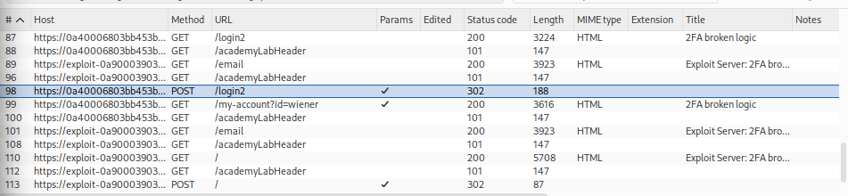

3. The GET /login2 uses the verify parameter to check to confirm the user, we send this to repeater to see if it works and sends us to the mfa code page or not. 

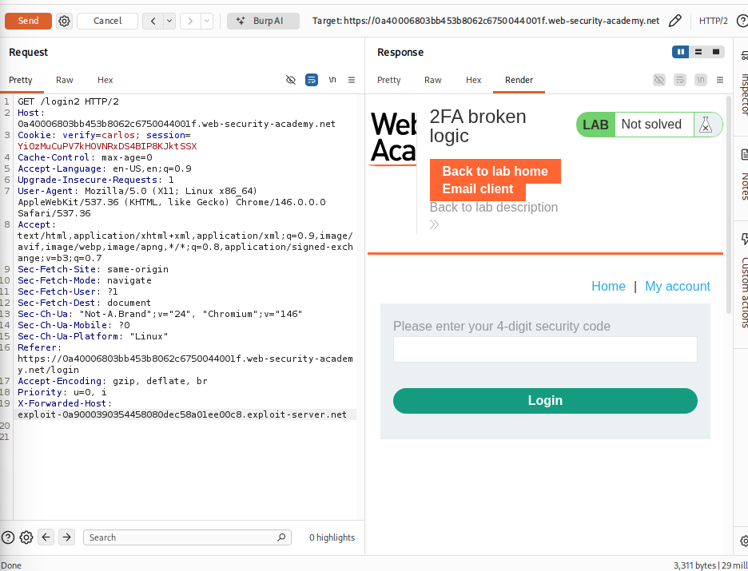

4. We can see that the GET /login2 sends us directly towards the 4-digit security code page. So this means that a temporary 2FA code was generated for carlos.

5. The POST/ login 2 sends the mfa-code. 

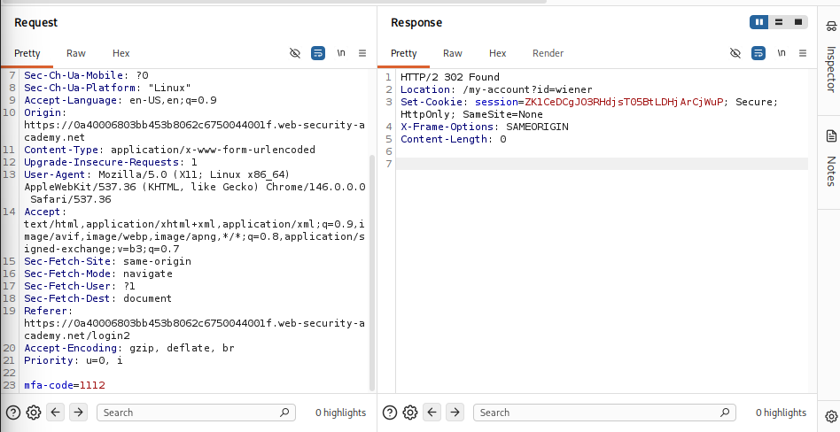

6. We now login again with wiener and peter. We submit an invalid code. We send the request to intruder and set the parameter verify to carlos and add a payload position of mfa-code and brute force the payload. But since im running burpsuite community edition, it will be impossible to do that. 

## Failing to handle unconventional input

One aim of the application logic is to restrict user input to values that adhere to the business rules.
For an example, When ordering any products, users typically specify the quantity that they want to order. Although any integer is theoretically a valid input, the business logic might prevent users from ordering more units that are currently in stock.

### Lab: High-level logic vulnerabiltiy

1. We first normally tey to purchase an item and see the process of purchase in burpsuite.

2. Here we can see that a POST request is being made to /cart. We change the quantity to a negative number and send it there. 

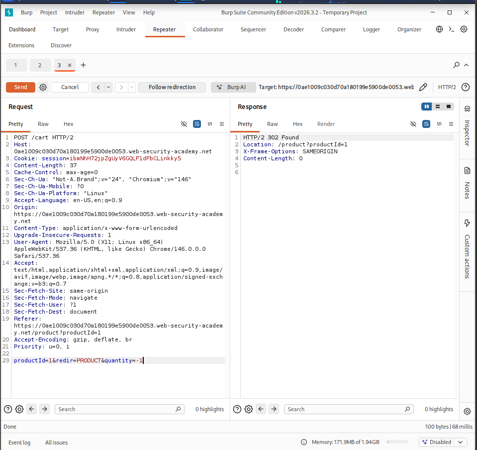

3. We can now see that the total price has changed to -1337.00. 
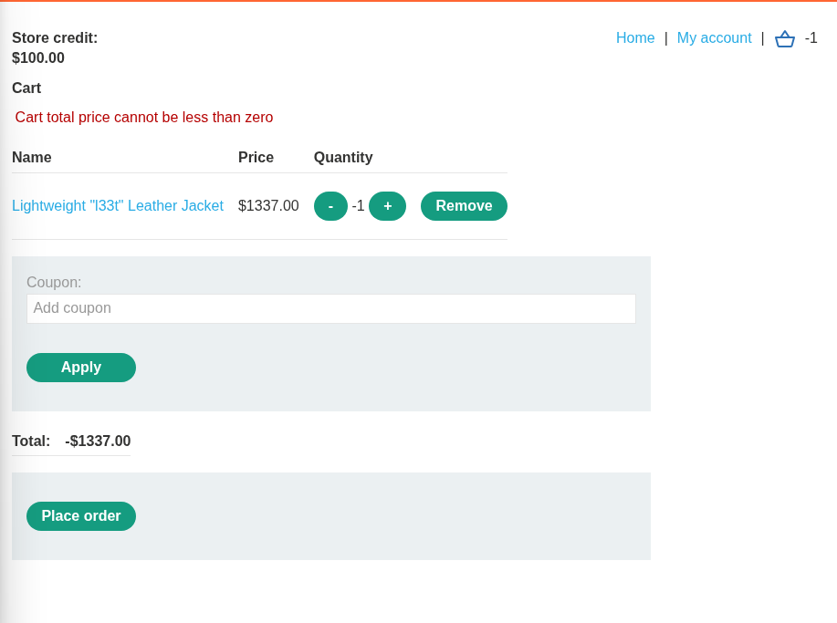

4. We now add another item to bring back the price to a positive value just wihtin our $100 store credit.

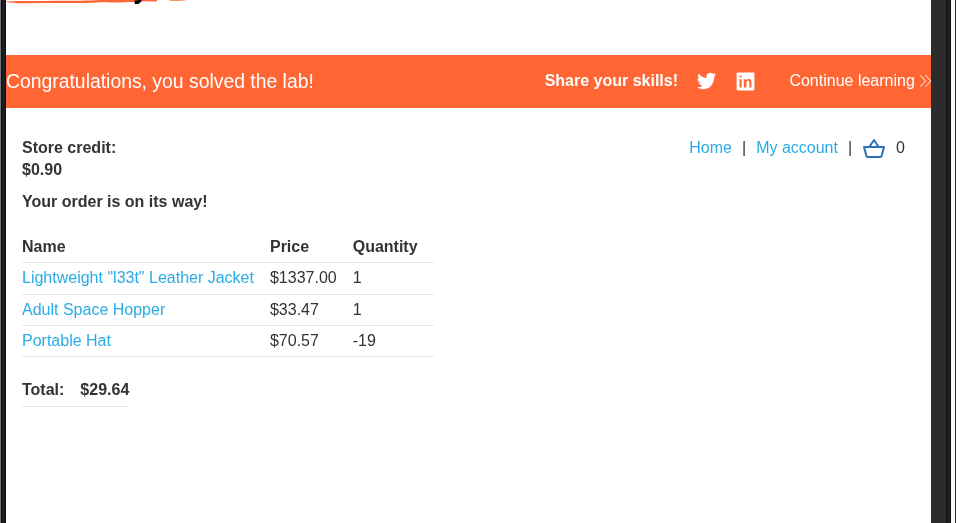

Here, by carefully calculating everything, we sucessfully purchased a lightweight leather jacket worht $1337.00

### Lab: Low-Level logic flaw:

This lab doesn't adequately validate user input. You can exploit a logic flaw in its purchasing workflow to buy items for an unintended price. To solve the lab, buy a "Lightweight l33t leather jacket".

You can log in to your own account using the following credentials: wiener:peter

1. As usual, first we identify the workflow of the purchase. 

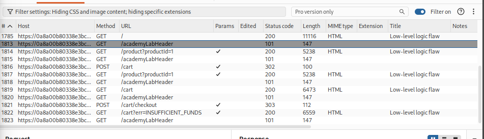

The process is similar to the one we just did!

2. We can only add 2 digit quantity. If we add 3 digit number like "100", then we get an error message.
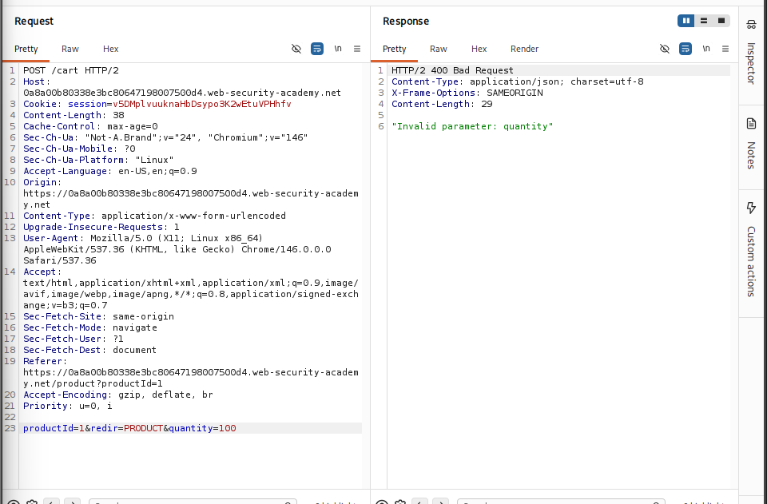

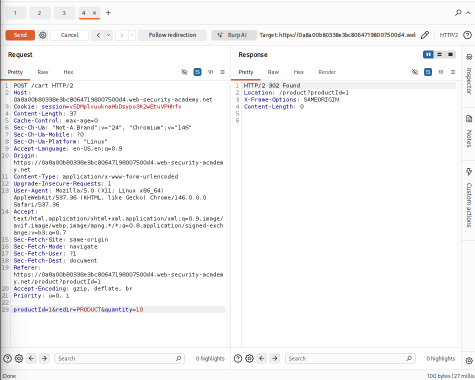

3. So we now need to go to intruder and set the quantity parameter to 99. And configure the payload type as Null payloads and payload configuration as continue indefinitely.

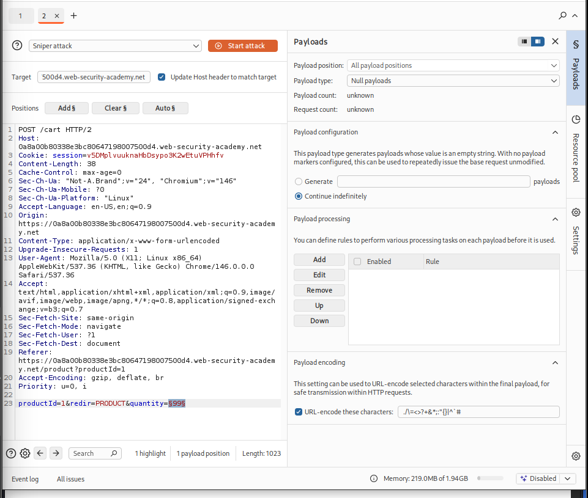

We now start the attack.

4. Now we can see that there's a lot of quantity being added. We want the application to crash or to behave in an abnormal way.

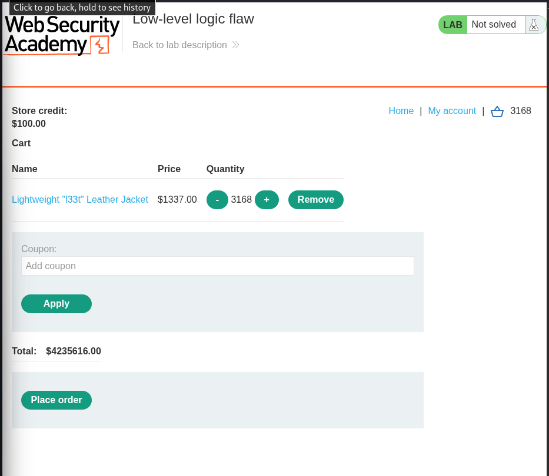

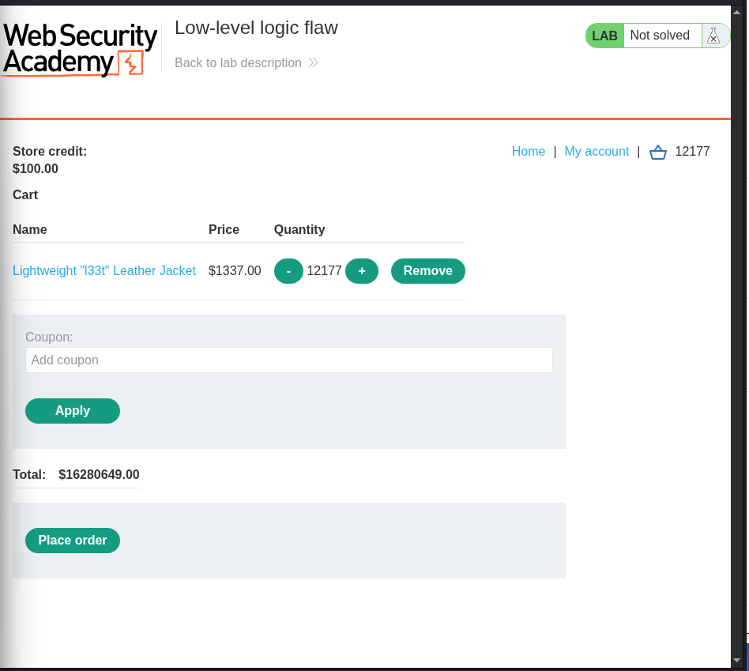

So at one point the total amount should equal to negative due to wraparound. Since the maximum value is not assigned, after the max value assigned it goes to the smallest integer. This is a typical behavior from a signed integer. 
Then we need to carefully calculate and start adding items in reverse order to balance out the credit as we want it to be under $100.00.
My version of burp suite is community so It will take me alot of time to complete this lab.. :)

### Lab: Inconsistent handling of exceptional input

1. We check the behavior of the application registration process. 

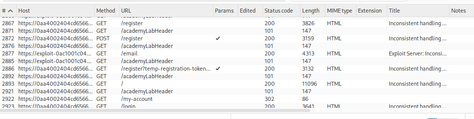
   
2. We try to truncate characters and see what happens. So we first need to send the POST /register request to intruder and add the email prefix as payload.

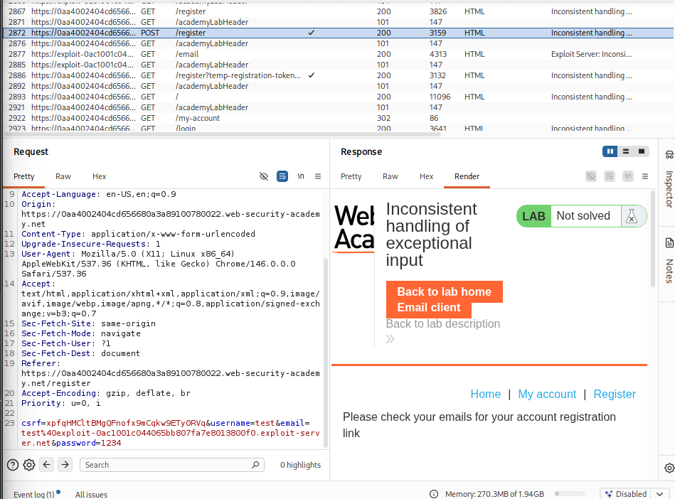

3. In payload type, we need to select character blocks and configuration is minimum length 100 and maximum length 1000.

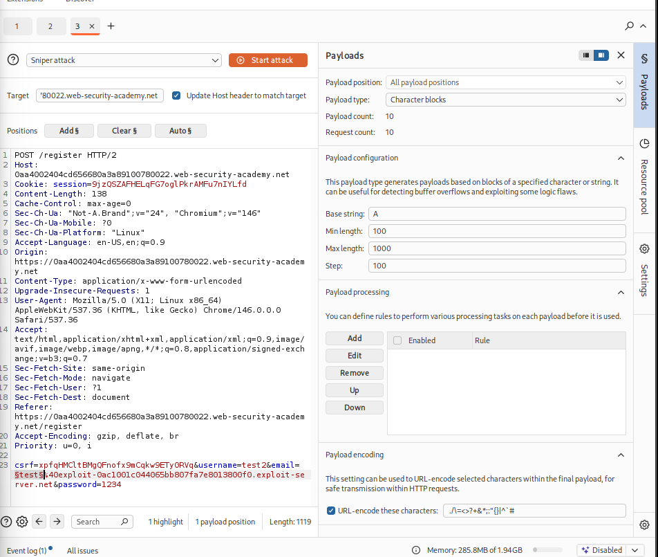

4. We can see that there is a list of AAAAAAAAA..........., and no domain shown. We can now carefully craft a payload which will read till @dontwannacry only.

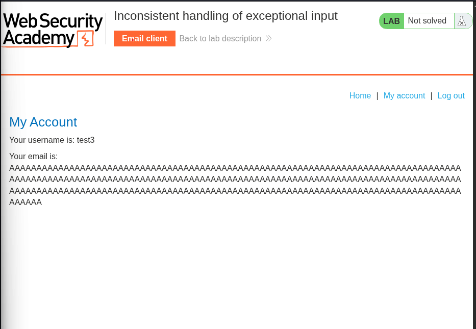

5. We now need to create a new user and capture the POST /register request and manipulate the email parameter there. 

6. Now we can see that we get HTTP 200 response, so everything is good to go.

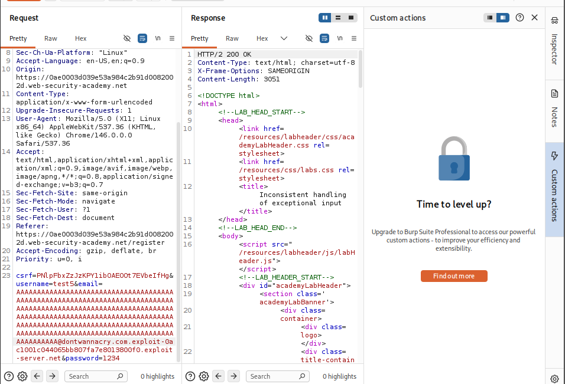

